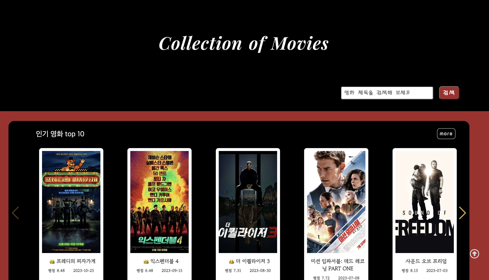
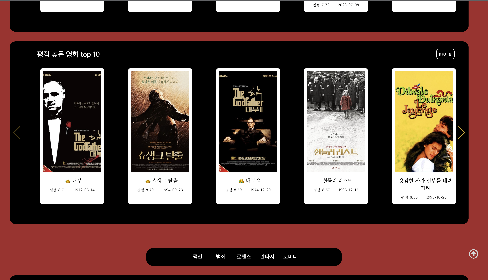
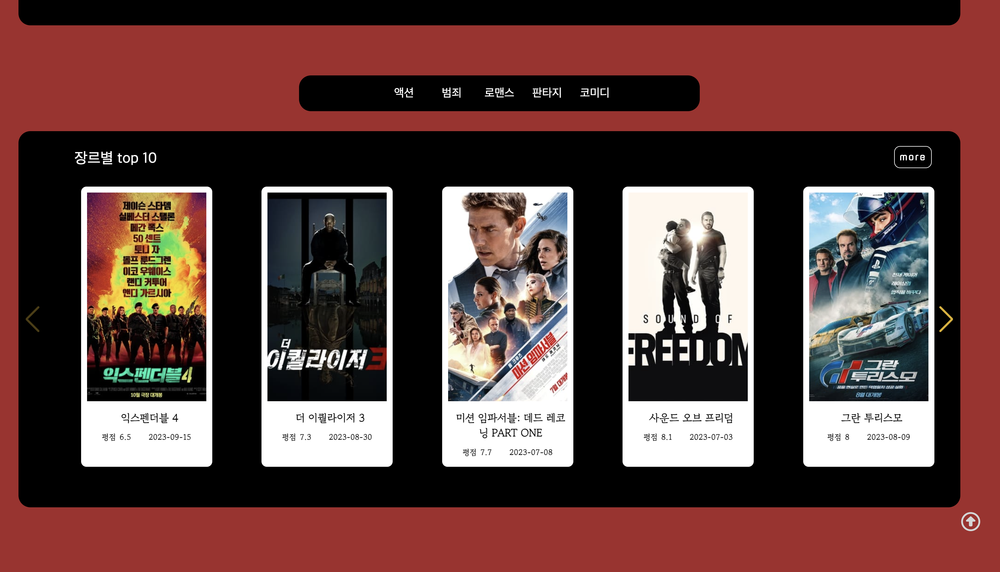
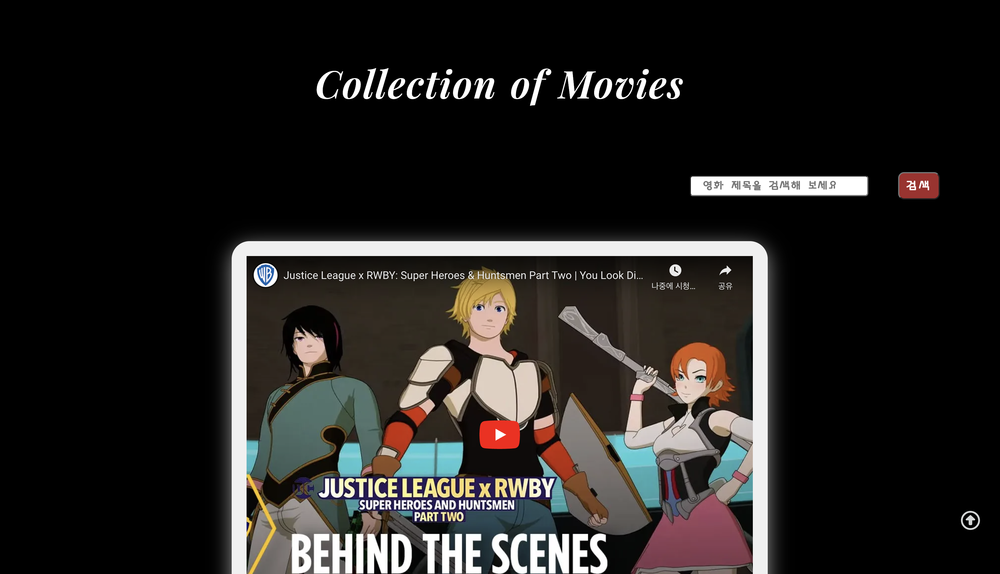
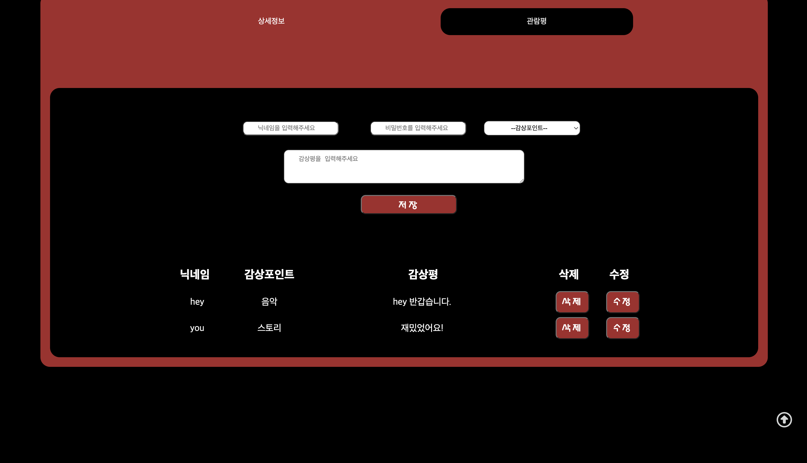
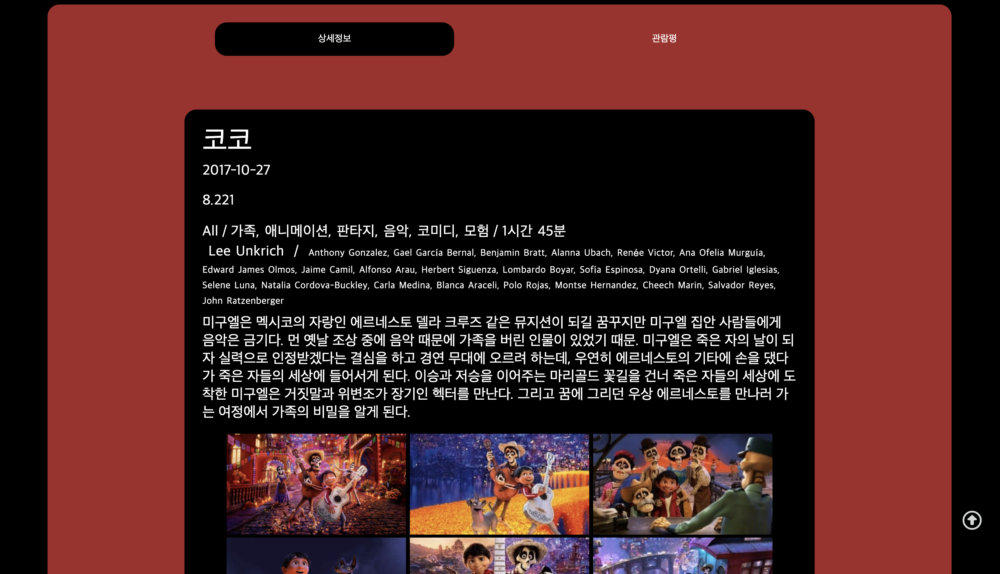

# 영화 정보 제공 서비스

 
 

> https://hyojinkim2028.github.io/team2Project/

 
 
 
 

 

 

 

 

 

 

 
 
 
 
 

# 팀원 및 맡은 역할

 

- 김효진

  > 메인페이지 하단 장르별 탭화면 구성& 슬라이드 기능 
  > 관람평 로컬스토리지 데이터 작성, 조회, 상세페이지 css 
  > 검색값 입력 벨리데이션 구현 
  > 깃 관리, 코드 정리 

 
 

- 유은지
  > 메인페이지, 리스트페이지 css 작업 
  > 메인페이지 상단 인기순위 & 평점순 순위 슬라이드 기능 
  > 리스트페이지 항목별 영화 보여주기 기능 
  > 모든 페이지 더보기 기능 구현 
  > 모든 페이지 검색 기능 구현 
  > 검색값 입력 벨리데이션 구현 
  > 관람평 로컬스토리지 데이터 보여주기 및 수정, 삭제기능 구현 

 
 

- 고병옥
  > 상세페이지 상세정보 영상 제외 모든 데이터 가져오기 
  > 상세페이지 동영상 부분 css 
  > 관람평 입력 벨리데이션 체크 

 
 

- 하정현

  > 상세페이지 관람평 기능 조회 
  > 상세페이지 관람평 기능 작성 
  > 상세페이지 관람평 기능 삭제 
  > 로컬스토리지 자료조사 

 
 

- 이상권
  > 상세페이지 동영상 불러오기 
  > 상세페이지 탭구성 담당 

 
 

## 프로젝트 개요

 

> 영화 정보를 제공하는 서비스를 만들었습니다. 
> 사용자는 원하는 순위로 영화를 볼 수 있으며, 영화를 장르별로 찾아볼 수 있는 기능을 제공합니다. 
> 영화에 대한 간단한 영상과, 상세정보 또한 볼 수 있도록 서비스를 제공하고 있습니다.  
> 사용자는 자신의 리뷰를 작성할 수 있으며 수정/삭제가 가능합니다.

   
   
   
 

## 주요 기능

- 영화 검색 기능

  > TMDB API를 통해 영화 정보를 검색할 수 있습니다.

  

- 영화 소개

  > 영화에 대한 상세 정보 및 포스터를 제공합니다.

  

- 사용자 리뷰

  > 사용자는 로컬 스토리지를 사용하여 자신의 리뷰를 작성하고 확인할 수 있습니다.
  > 사용자는 비밀번호를 이용해 리뷰를 삭제, 수정 할 수 있습니다.

  

- 원하는 조건으로 영화 리스트 보기

  > 영화를 장르별로 필터링하여 찾을 수 있습니다.
  > 영화를 인기순으로 볼 수 있습니다.
  > 영화를 평점순으로 볼 수 있습니다.

  

- 검색 기능

  > 검색 기능은 모든 페이지에서 사용 가능합니다.

  

- 더보기 기능

  > 더보기 기능은 검색결과를 포함한 모든 페이지에서 사용 가능합니다.

  

- 이미지 없을때 다른 이미지

  > 영화 이미지가 존재하지 않는경우, 다른 이미지로 대체하여 보여줍니다.

  

 
 
 
 

## 사용 도구

 
 

> - Git 및 GitHub: 버전 관리 및 협업
> - Font Awesome: 프론트엔드 아이콘 사용
> - Swiper: 프론트엔드 카드 슬라이드 기능 사용
> - Figma: 와이어프레임 디자인
> - VS Code: 코드 편집기
> - HTML: 주요 프로그래밍 언어
> - CSS: 주요 프로그래밍 언어
> - JavaScript: 주요 프로그래밍 언어
> - TMDB API: 영화 정보 수집에 사용

 
 
 
 

## 폴더 구조

 
 

📦src 
┣ 📜append.js 
┣ 📜detail.js 
┣ 📜genreTap.js 
┣ 📜getData.js 
┣ 📜go.js 
┣ 📜list.js 
┣ 📜main.js 
┣ 📜makeUrl.js 
┣ 📜more.js 
┗ 📜swiper.js 

 
 

📦css 
┣ 📜common.css 
┣ 📜detail.css 
┣ 📜main.css 
┣ 📜reset.css 
┗ 📜swiper.css 
